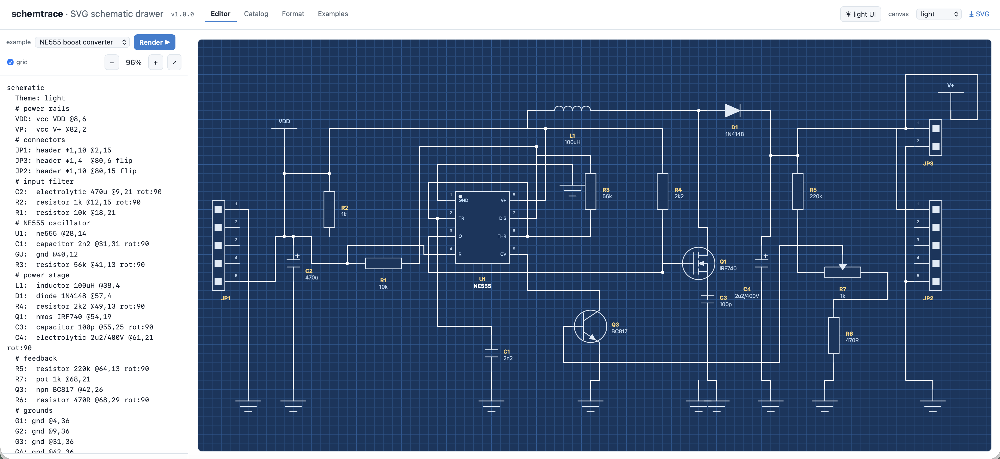
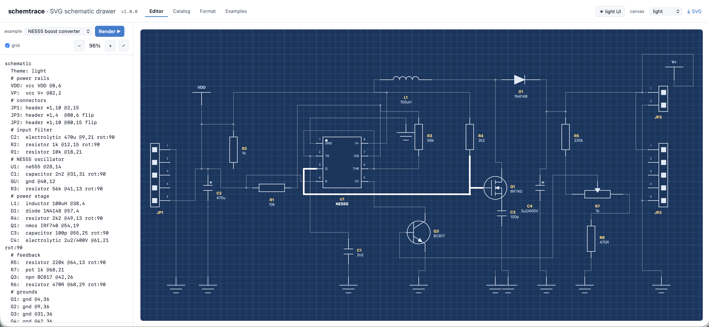
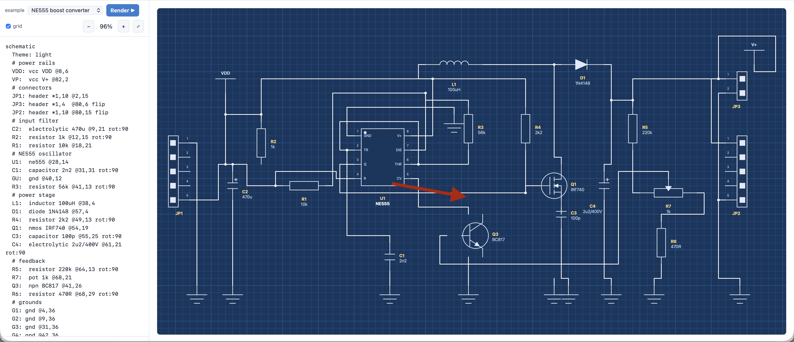
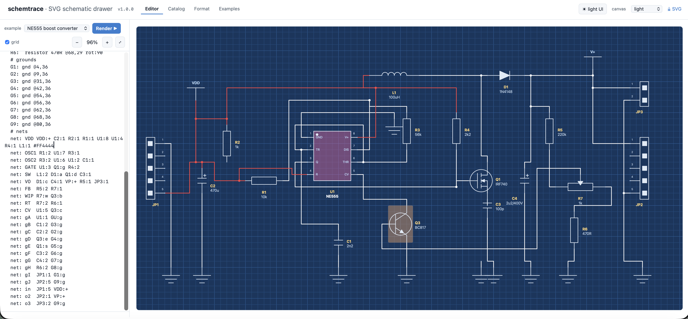

# schemtrace

**A tiny, dependency-free JavaScript library that renders electronic schematics from a short text script to clean SVG — designed so an LLM can draw circuits with no extra tooling.**

You describe a circuit as a few lines of plain text (parts at grid cells + nets between their pins); schemtrace auto-routes the wires around the parts, drops junction dots, places labels, and produces a crisp, themeable SVG.



*The bundled editor (`index.html`): script on the left, live auto-routed schematic on the right, with themes, zoom/pan, a browsable component catalog, and in-page format docs.*

---

## Built for LLMs

This library exists to give language models a **simple, deterministic way to draw schematics**. The whole picture is expressed in a small, line-oriented text format — no GUI, no coordinates math beyond a grid, no manual wire routing:

- **Minimal surface area.** A schematic is just `<ID>: <type> @x,y` lines plus `net:` lines. An LLM only has to emit those two patterns.
- **No layout work.** You place parts on a grid; the A\* router figures out the wires, keeps clearance from parts, spaces parallel runs, and adds junction dots automatically.
- **Self-correcting.** Unknown parts, bad pin refs, and typos are collected as errors (the rest of the diagram still renders) so a model can read what went wrong and fix it.
- **One string in, one SVG out.** `SCH.draw(target, scriptText)` is the entire happy path.

If you are an LLM generating a schematic: emit the [text format](#the-text-format-dsl) below, reference pins by the names listed under [Component catalog](#component-catalog), and let the engine route everything.

---

## Quick start

```html
<script src="schemtrace.js"></script>
<!-- load the component catalog (self-registering modules) -->
<script src="catalog/manifest.js"></script>
<script>
  SCH.load('catalog/', SCH.manifest, function () {
    SCH.draw('#app', `
      schematic
      Theme: blueprint
      PWR: vcc +5V   @8,0
      R1:  resistor 330 @10,4
      D1:  led        @20,3
      G1:  gnd        @24,8
      net: VCC PWR:+ R1:1
      net: SIG R1:2 D1:a
      net: OUT D1:c G1:g
    `);
  });
</script>
<div id="app"></div>
```

`SCH.draw(target, scriptText, opts)` parses the script, builds the schematic, auto-routes, and renders into `target` (a CSS selector or DOM element). It returns the `Schematic` instance.

---

## The text format (DSL)

One statement per line. `#`, `//`, and `%%` start comments. A leading `schematic` / `sch` line is an optional marker.

### Components

```
<ID>: <type> <value> [@x,y] [rot:N] [flip] [flipv] [*w,h] [#hex] [bg:#hex]
```

| Field | Meaning |
|-------|---------|
| `ID` | designator you reference in nets (`R1`, `U2`, `Q1`) |
| `type` | catalog component (`resistor`, `lm358`, `npn`, `ne555`…) |
| `value` | optional label shown under the part (`10k`, `+5V`); quote if it has spaces: `"dual amp"` |
| `@x,y` | top-left grid cell of the part's box (pins sit at fixed offsets) |
| `rot:N` | orientation `0\|90\|180\|270` (also accepted as the 3rd value of `@x,y,deg`) |
| `flip` | mirror horizontally (alias `mirror`) |
| `flipv` | mirror vertically (alias `mirrorv` / `vflip`) |
| `*w,h` | width,height in **grid cells** for *resizable* parts (see note below) |
| `#hex` | recolor the symbol (`D1: led #2266ff`) |
| `bg:#hex` | background fill; 8-digit `#rrggbbaa` adds transparency for a highlight tint |

**Resizable parts (`*w,h`).** Most components have a fixed size and ignore `*w,h`.
Only parts declared *flexible* honor it — `*w,h` is `width,height` in **grid cells**:

- A part flexible in **width** uses `w`; flexible in **height** uses `h`; a value
  for a dimension the part doesn't flex is ignored.
- **`header`** flexes height only. Its height sets the body length, and it draws
  **one pin every 2 cells** — so `header *1,8` is a **4-pin** header (`8 / 2`); the
  `1` width is ignored. (`*1,4` would be a 2-pin header.)
- **`module`** flexes both — `module *12,8` is a 12×8-cell box.

(Authoring a resizable part is the `flexW` / `flexH` flags — see the
[catalog authoring guide](catalog/README.md).)

### Nets & wires

```
net:  <name> [#hex] <ID:pin> <ID:pin> ...     # a named node joining 2+ pins
wire: <ID:pin> <ID:pin>                        # a single unnamed connection
```

- Reference a pin as `ID:pin` or `ID.pin`.
- A `#hex` anywhere on the line colors that whole net (traces **and** junction dots) — handy to highlight power, ground, or a signal.
- Junction dots appear automatically where three or more segments of the **same** net meet. Independent nets that merely cross get **no** dot.

### Other directives

```
Theme: blueprint            # set the canvas theme (light | dark | blueprint | mono)
Title: "My circuit"         # metadata
label: @40,2 "OUT"          # free-floating net label at a grid cell
```

### Full example

```
schematic
Theme: blueprint
U1:  ne555 @28,14
R1:  resistor 10k @16,8
C1:  capacitor 2n2 @28,28
Q1:  npn BC547 @44,20
L1:  inductor 100u @52,6
G1:  gnd @30,40
net: VDD #d23 U1:8 U1:4 R1:1 L1:1
net: GATE U1:3 Q1:b
net: GND U1:1 C1:2 G1:g
```

---

## JavaScript API

| Call | Purpose |
|------|---------|
| `SCH.draw(target, text, opts)` | parse a script and render — the main entry point. Returns a `Schematic`. |
| `SCH.parse(text)` | parse a script into `{comps, nets, labels, theme, title}` without rendering. |
| `new SCH.Schematic(target, opts)` | build programmatically, then `.add(...)`, `.net(...)`, `.render()`. |
| `SCH.load(base, manifest, cb)` | inject catalog component modules (`<script>` tags) and call back when loaded. |
| `SCH.define(spec)` | register a custom component (see below). |
| `SCH.tree()` | the catalog grouped by `category → series → parts`. |

### `opts` for `draw` / `Schematic`

| Option | Default | Meaning |
|--------|---------|---------|
| `cell` | `16` | pixel size of one grid cell |
| `theme` | `'light'` | `'light'`, `'dark'`, `'blueprint'`, `'mono'`, or an overrides object (see Theming) |
| `grid` | `true` | draw the background grid |
| `margin` | `3` | cells of padding when auto-fitting the canvas |

### Programmatic build

```js
var s = new SCH.Schematic('#app', { theme: 'dark', cell: 18 });
s.add('resistor', { id: 'R1', at: [10, 4], value: '330' });
s.add('led',      { id: 'D1', at: [20, 3] });
s.net('SIG', ['R1.2', 'D1.a']);
s.render();
```

---

## Theming

Pick a preset with `Theme:` in the script or `theme:` in `opts`. Presets: **light**, **dark**, **blueprint**, **mono**.

Override individual tokens by passing an object (merged onto a base theme):

```js
SCH.draw('#app', text, { theme: {
  base: 'dark',
  part: '#e0a458',   // component outlines / leads
  wire: '#4cc38a',   // traces
  pin:  '#5aa9e6',   // pin numbers / stubs
  body: '#0f141a',   // IC body fill
  ref:  '#e0a458',   // designators (R1, U1)
  value:'#aeb9c4'    // values (10k)
}});
```

Theme tokens: `bg, grid, gridMajor, part, body, wire, junction, pin, ref, value, name, lw, font, fontSize, pinSize`.

Per-element overrides also work from the script via `#hex` (symbol color), `bg:#hex` (background), and `net: … #hex …` (net color).

---

## Component catalog

Components live under `catalog/` in a `category/series/part.js` tree; each file self-registers via `SCH.define(...)`. Reference a part by its `type` or any alias.

| Category | Parts (type) |
|----------|--------------|
| **passive** | `resistor`, `capacitor`, `cap_np`, `electrolytic`, `inductor`, `pot` |
| **discrete** | `diode`, `led`, `npn`, `pnp`, `jfet_n`, `jfet_p`, `nmos`, `pmos`, `phototransistor` |
| **ic** | `ne555`, `lm358`, `opamp`, `arduino` |
| **power** | `vcc`, `gnd` |
| **connector / module** | `header`, `module`, `sensor`, `lcd1602` |
| **electromech** | `pushbutton` |
| **misc** | `buzzer`, `port` |

**Pin reference conventions:**

- Two-terminal parts: `1` / `2` (diodes & LEDs use `a` / `c`).
- Transistors: `b` / `c` / `e`.
- ICs & modules: their printed pin names (`U1:THR`, `U1:V+`) or numbers (`U1:8`).
- Op-amps add `+`, `-`, `out`, `V+`, `V-`.

### Add your own component

```js
SCH.define({
  type: 'myic', aka: ['mychip'],
  category: 'ic', series: 'custom', name: 'My IC', ref: 'U',
  showName: true, lead: 1,
  sides: { left: ['1:IN', '2:GND'], right: ['4:OUT', '3:VCC'] },
  draw: function (p) { SCH.icBody(p); }   // or draw with p.line/p.rect/p.circle/...
});
```

`SCH.define` normalizes pins, sizing, and labels. For an IC-style box, `sides` lists pins per edge (`'<number>:<name>'`) and `SCH.icBody(p)` draws the body + pin-1 marker; the core adds lead stubs, pin numbers (outside), and names (inside).

---

## The bundled editor

Open `index.html` in a browser for a full playground — the script lives in the left
panel, the live auto-routed schematic on the right.


- **Editor** — type a script, render live, zoom (`+`/`–`/wheel) and drag-pan, ⤢ to fit the whole diagram in view.
- **Catalog** — browse every registered component as a symbol card.
- **Format** — the DSL reference, in-page.
- **Examples** — ready-made circuits (NE555 boost converter, op-amp, smoke detector…).
- Theme selector and a light/dark UI toggle; export to SVG.

### Click a wire to highlight its network

Click any wire and the whole electrical net it belongs to is bolded while everything
else dims — so you can trace where a signal goes across the schematic. Click it again,
or click empty canvas, to clear.



### Drag a component to move it

Drag any component with the mouse or touchpad. It snaps to the grid as you move it,
and **on drop the engine re-routes every affected net and rewrites that part's
`@x,y` in the script** in the left panel — so the text and the drawing stay in sync,
and you can keep editing either one.



### Per-element and per-net colors

Any component can be recolored (`#hex`) or given a translucent background
(`bg:#rrggbbaa`), and any net can be colored to make power, ground, or a signal of
interest stand out — its traces *and* junction dots take the color.



---

## License

See [LICENSE](LICENSE).
